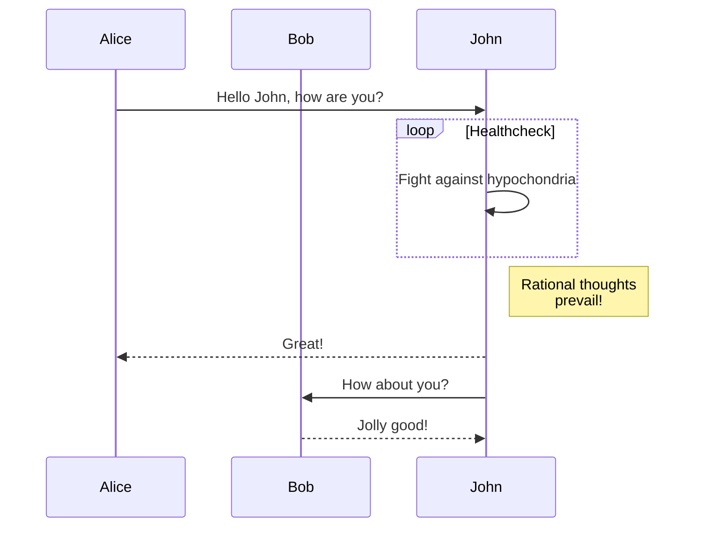
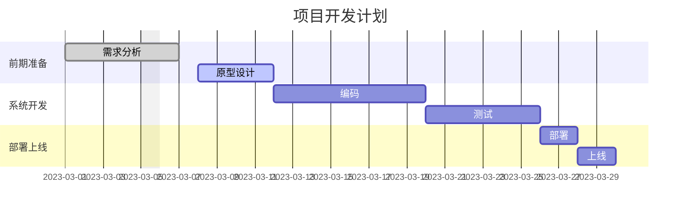
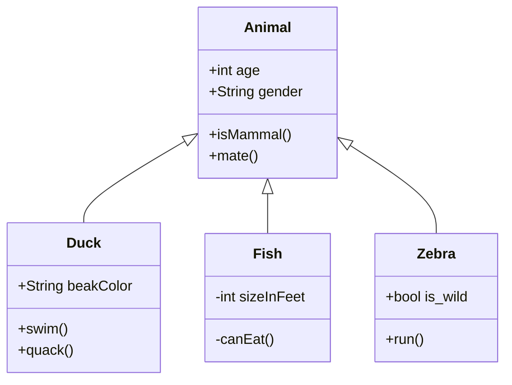

## Markdown Basic Syntax

I just love **bold text**. Italicized text is the _cat's meow_. At the command prompt, type `nano`.

My favorite markdown editor is [ByteMD](https://github.com/bytedance/bytemd).

1. First item
2. Second item
3. Third item

> Dorothy followed her through many of the beautiful rooms in her castle.

```js
import gfm from '@bytemd/plugin-gfm'
import { Editor, Viewer } from 'bytemd'

const plugins = [
  gfm(),
  // Add more plugins here
]

const editor = new Editor({
  target: document.body, // DOM to render
  props: {
    value: '',
    plugins,
  },
})

editor.on('change', (e) => {
  editor.$set({ value: e.detail.value })
})
```

## GFM Extended Syntax

Automatic URL Linking: https://github.com/bytedance/bytemd

~~The world is flat.~~ We now know that the world is round.

- [x] Write the press release
- [ ] Update the website
- [ ] Contact the media

| Syntax    | Description |
| --------- | ----------- |
| Header    | Title       |
| Paragraph | Text        |

## Footnotes

Here's a simple footnote,[^1] and here's a longer one.[^bignote]

[^1]: This is the first footnote.
[^bignote]: Here's one with multiple paragraphs and code.

    Indent paragraphs to include them in the footnote.

    `{ my code }`

    Add as many paragraphs as you like.

## Gemoji

Thumbs up: :+1:, thumbs down: :-1:.

Families: :family_man_man_boy_boy:

Long flags: :wales:, :scotland:, :england:.

## Math Equation

Inline math equation: $a+b$

简单行内公式测试: $x = {-b \pm \sqrt{b^2-4ac} \over 2a}$

$$
\displaystyle \left( \sum_{k=1}^n a_k b_k \right)^2 \leq \left( \sum_{k=1}^n a_k^2 \right) \left( \sum_{k=1}^n b_k^2 \right)
$$

复杂块级公式测试:

$$
\begin{align}
\frac{\partial \mathcal{L}}{\partial \boldsymbol{w}} &= \frac{\partial}{\partial \boldsymbol{w}}\left[ \frac{1}{2}(\boldsymbol{y} - X\boldsymbol{w})^T (\boldsymbol{y} - X\boldsymbol{w}) + \frac{\lambda}{2}\boldsymbol{w}^T\boldsymbol{w} \right] \\
&= \frac{\partial}{\partial \boldsymbol{w}}\left[ \frac{1}{2}\boldsymbol{y}^T\boldsymbol{y} - \boldsymbol{y}^TX\boldsymbol{w} + \frac{1}{2}\boldsymbol{w}^TX^TX\boldsymbol{w} + \frac{\lambda}{2}\boldsymbol{w}^T\boldsymbol{w} \right] \\
&= -X^T\boldsymbol{y} + X^TX\boldsymbol{w} + \lambda \boldsymbol{w}
\end{align}
$$

矩阵公式测试:

$$
\begin{bmatrix}
a & b & c \\
d & e & f \\
g & h & i
\end{bmatrix}
\cdot
\begin{bmatrix}
x \\
y \\
z
\end{bmatrix}
=
\begin{bmatrix}
ax + by + cz \\
dx + ey + fz \\
gx + hy + iz
\end{bmatrix}
$$

## Mermaid Diagrams

### 流程图


### 序列图



### 甘特图



### 类图


